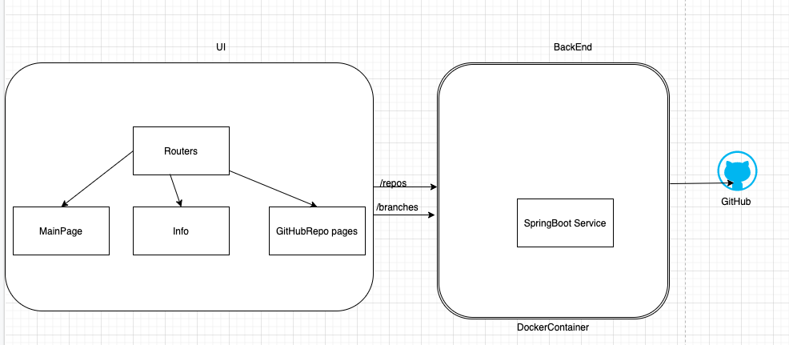

# Quasar App (softwarearchitecture)

A Quasar Project

## Install the dependencies
```bash
yarn
# or
npm install
```

### Start the app in development mode (make sure the backend service is running using its instructions from another cmd prompt)
```bash
quasar dev
```


### Lint the files
```bash
yarn lint
# or
npm run lint
```


### Format the files
```bash
yarn format
# or
npm run format
```


### Build the app
```bash
quasar build
```

### launch the app (make sure the backend service is started using its instructions from another cmd prompt)
```bash
quasar dev
```

### Customize the configuration
See [Configuring quasar.config.js](https://v2.quasar.dev/quasar-cli-webpack/quasar-config-js).

### Service Architecture


