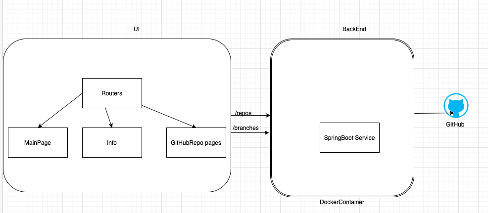

## Flask Microservice (Docker)

## Flask Microservice

First, install dependencies.

    $ pip install flask
    $ pip install pyyaml

After, run the Flask app as follows:

    $ export FLASK_APP=app.py
    $ flask run
    * Running on http://127.0.0.1:5000/

To run this app

    chmod +x start_app.sh
    ./start_app.sh

